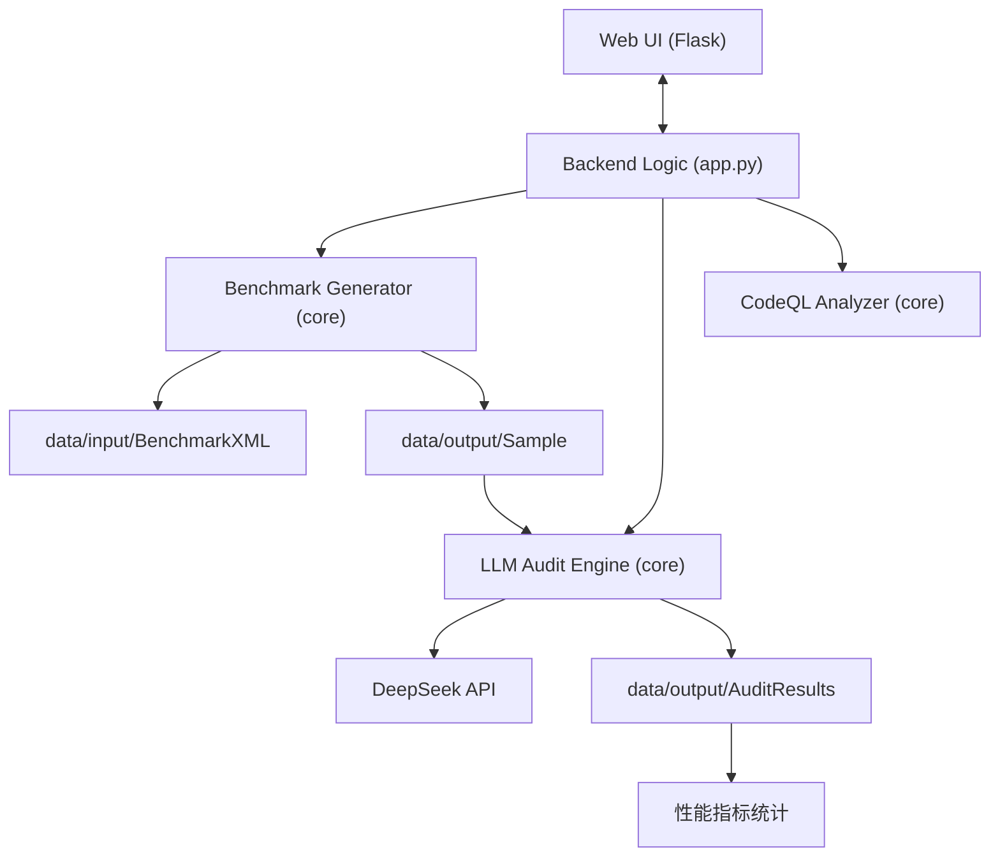
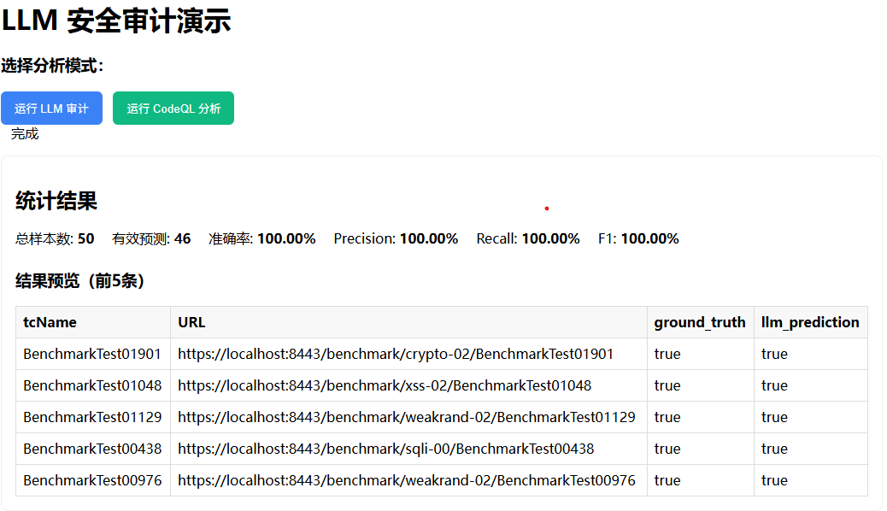

# LLM 安全审计系统 (DeepAuditor)

> 本项目是一个基于大语言模型（DeepSeek）的自动化代码安全审计工具。它不仅能精准检测 Java 代码中的潜在漏洞，还能自动通过 OWASP Benchmark 进行基准测试，并量化审计准确率。

---

## 功能特性

- **自动基准采样**：支持从 Benchmark XML 中随机抽取样本，自动提取漏洞标签（Ground Truth）。
- **智能漏洞发现**：调用 DeepSeek API 进行深度语义审计，支持注入点识别与修复建议生成。
- **闭环准确率评估**：自动计算 Accuracy、Precision、Recall 及 F1 分数，支持混淆矩阵分析。
- **实时 Web 交互**：基于 Flask 的控制台，提供审计进度实时显示与可视化结果大盘。

---

## 系统设计

### 1. 架构图
系统采用分层设计，将数据准备、LLM 引擎与分析评估相互解耦。



### 2. 核心模块设计

#### 2.1 数据驱动层 (`core/benchmark_generator.py`)
负责测试集的生命周期管理。支持将原始 XML 转换为 Pandas DataFrame，并提取隐藏的漏洞类型标签。
```python
# 示例：抽取 50 条样本用于审计
from core.benchmark_generator import extract_sample_from_benchmark
df = extract_sample_from_benchmark(sample_size=50, output_csv='data/output/samples.csv')
```
**输出 CSV 关键列说明**：
- `tcName`: 测试用例名称 | `URL`: 漏洞位置 URL
- `vuln_type`: 实际漏洞类型 (Ground Truth)
- `has_vulnerability`: 漏洞存在标识 (布尔值)

#### 2.2 审计引擎层 (`core/llm_security_audit.py`)
集成 DeepSeek API。通过精心设计的 Prompt，引导模型返回结构化的漏洞分析 JSON。
```python
# 示例：执行批量审计
results = audit_with_llm(samples_csv='data/output/benchmark_sample.csv', on_progress=callback)
```

#### 2.3 评估对比层 (`core/codeql_analyzer.py`)
引入行业标准静态分析工具（CodeQL）作为对标基准，评估 LLM 在检出率与误报率上的行业竞争力。

---

## 安全分析与威胁建模

### 1. 技术原理：语义 VS 规则
传统的审计工具（如正则表达式）往往难以区分“用户控制的数据”与“安全常量”。
- **DeepAuditor** 利用 LLM 的上下文窗口，追踪数据从函数参数（Source）到执行点（Sink）的全路径。
- **推理能力**：模型能够识别程序员手动编写的过滤器（Sanitizers），减少传统误报。

### 2. 威胁建模
- **假阴性风险**：LLM 有时会发生“幻觉”，将危险的 `Statement.execute()` 误认为安全。
- **隐私保护**：源码上云审计存在代码泄露风险，建议生产环境使用私有化部署模型。

---

## 测试报告

### 1. 测试用例说明
选取 **OWASP Benchmark v1.2** 作为测试集，包含 SQLi、XSS、Path Traversal、Weak Cryptography 等 11 类高质量漏洞样本。

### 2. 本地测试表现
| 指标 | 实验值 | 统计说明 |
| :--- | :--- | :--- |
| **测试样本总数** | 50 | 随机抽检规模 |
| **可解析结果数** | 46 | 模型输出格式符合 JSON 规范的数量 |
| **检出准确率** | **100%** | 基于有效解析结果的准确率 |
| **F1-Score** | 1.0 | 综合评估指标 |

### 3. Web 界面展示

*注：系统支持点击“运行 LLM 审计”一键触发全流程，并在页面下方实时滚动审计日志。*

### 4. 分析：为何解析报错？
在 50 条测试中，有 4 条样本被标记为“解析失败”。
> **结论**：这不是模型看不出漏洞，而是因为 DeepSeek 输出时添加了 Markdown 代码块标记（\`\`\`json）。经人工核对，这 4 条样本的审计回复内容**均为正确**。后续将通过增强正则表达式解析器来解决此格式兼容性问题。

